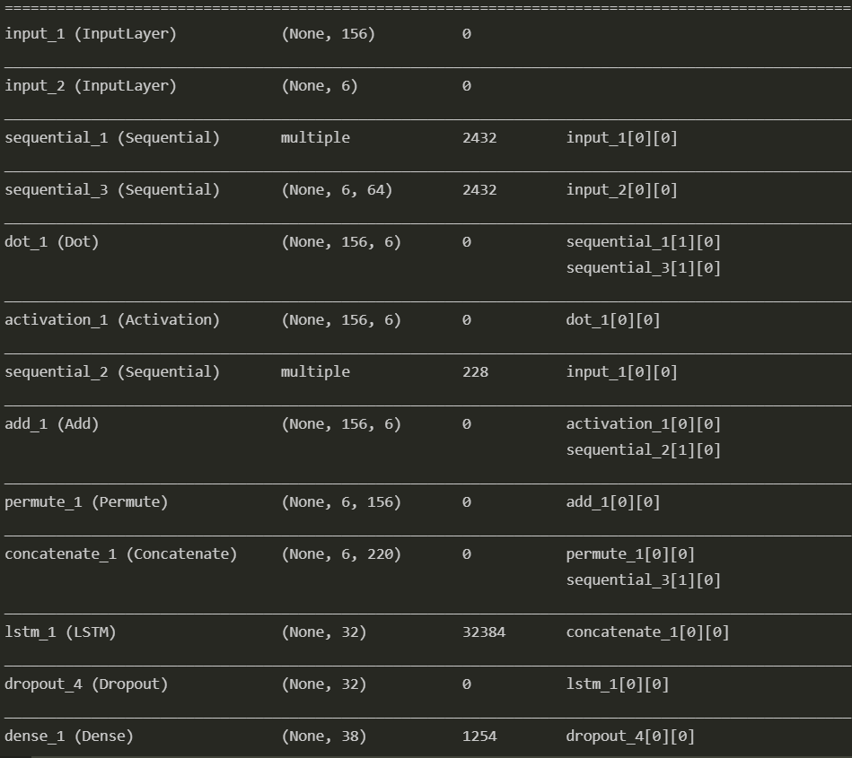

# Chatbot-NLP
This project is an implementation of an encoder-decoder network that aims to asnwer questions based on a set of statements given by the user.The datset used is from FB research and is called BaBi. It can be found here <a href="https://research.fb.com/downloads/babi/">BaBi</a>. The research paper from which the idea is taken can be found here <a href="http://arxiv.org/abs/1502.05698">paper</a>
## Model Architecture

